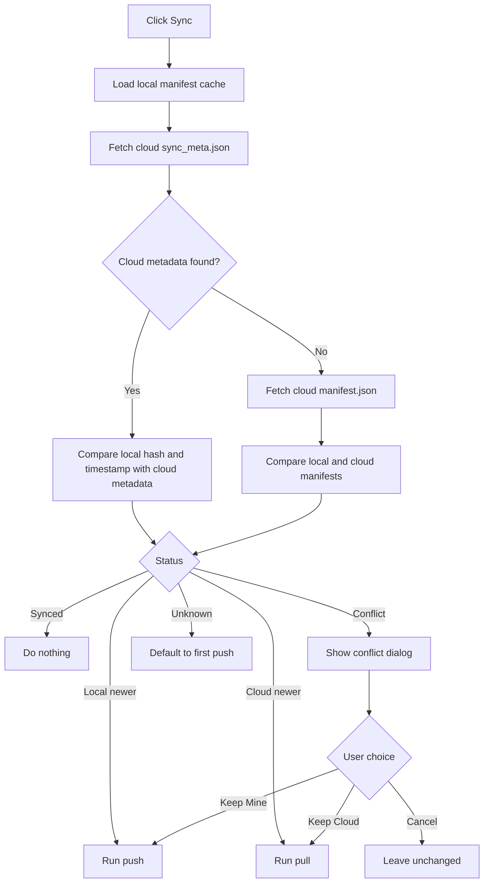
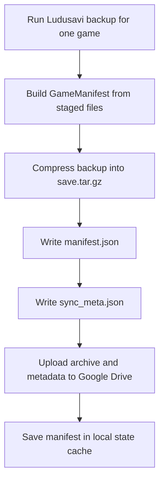
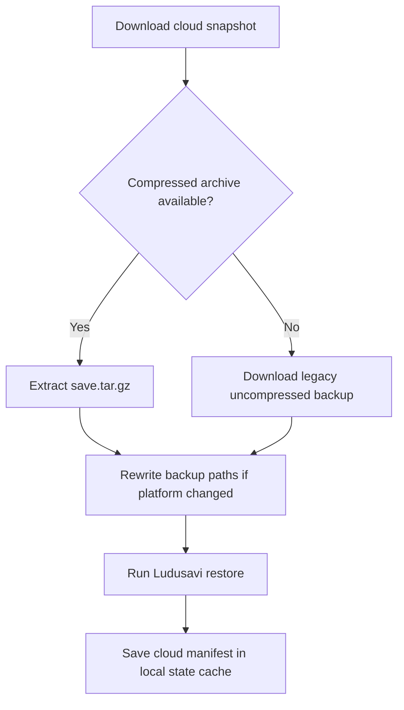

## SaveSync-Bridge: Universal Cloud Saves for Steam Deck & Windows


SaveSync-Bridge is an open-source PySide6 desktop application designed to bridge the gap between Windows PCs and Linux gaming handhelds like the Steam Deck. By leveraging the power of Ludusavi and Google Drive, SaveSync-Bridge provides a seamless, automated way to sync game saves across different operating systems—even for games that don't support Steam Cloud.

Whether you are switching from your desktop to your Steam Deck or moving between Windows and Wine/Proton prefixes, SaveSync-Bridge ensures your progress follows you.
Key Features

    Cross-Platform Sync: Effortlessly move saves between Windows and Linux/Steam Deck.

    Google Drive Integration: Uses rclone to turn your personal Google Drive into a private save-game cloud.

    Smart Conflict Resolution: Automatically detects which save is newer and prompts you to resolve version mismatches.

    Automated Path Rewriting: Intelligent logic to handle different file path structures between Windows and Proton/Wine.

    Powered by Ludusavi: Utilizes the industry-standard Ludusavi engine to discover and back up over 10,000+ games.

    Fast & Efficient: Uses a local manifest cache to perform "Smart Syncs" in seconds.

Why use SaveSync-Bridge?

If you play non-Steam games (Epic Games, GOG, Emulators) or titles without native cloud support, keeping your saves synchronized is a manual chore. SaveSync-Bridge automates this entire workflow with a single click, providing a "Sync Center" for your entire library.

## Sync Model

SaveSync-Bridge syncs at the game snapshot level, not file-by-file.

For each game, the app compares:

- the local cached manifest from the last successful sync on this machine
- the cloud `sync_meta.json` when available, or `manifest.json` as a fallback

The result drives a single smart sync button.



For multiple games (e.g., `Sync All`), the app uses an optimized batch process: download the entire cloud directory once, generate a full local backup, compare all manifests locally, then perform batched uploads and restores.

### What Push Does



### What Pull Does



## Current UI

The main window is now a Sync Center:

- `Refresh` rescans games visible to Ludusavi on the current machine
- `Sync All` smart-syncs every non-excluded game
- each game card has one `Sync` button and one exclusion checkbox
- the left sidebar filters by `All Games`, `Local Newer`, `Conflicts`, `Synced`, and `Excluded`
- the backup summary panel shows the active Google Drive remote, backup library, and token path
- the debug console shows the exact Ludusavi and rclone commands being executed

## Documentation

- User guide: [docs/USER_GUIDE.md](docs/USER_GUIDE.md)
- Technical documentation: [docs/TECHNICAL.md](docs/TECHNICAL.md)

## Requirements

- Python 3.13+
- `uv`
- Ludusavi and rclone binaries, either bundled under `src/savesync_bridge/bin/` or available on `PATH`

If the bundled binaries are missing in a development checkout, fetch them with:

```bash
uv run python scripts/fetch_bins.py --platform windows
```

Use `--platform linux` when preparing a Linux build.

## Setup

On first launch, open `Backups`, authenticate Google Drive, then choose the Drive folder and backup library path to use.

```bash
uv sync
uv run savesync-bridge
```

Configuration is stored in:

- Windows: `%APPDATA%/savesync-bridge/config.toml`
- Linux or Steam Deck: `~/.config/savesync-bridge/config.toml`

The saved Google Drive token is stored beside it in `rclone.conf`.

## Development

```bash
uv sync
uv run pytest
uv run ruff check src/ tests/
uv run ruff format src/ tests/
uv run build-exe
uv run package-release --version v0.3.1 --platform windows
```

## Cloud Builds And Releases

The repository includes two GitHub Actions workflows:

- `Cloud Build` builds Windows and Linux artifacts on pushes to `main` and on manual dispatch
- `Release` builds Windows and Linux release bundles for tags like `v0.3.1` and publishes them on GitHub Releases

To publish a tagged release:

```bash
git tag v0.3.1
git push origin v0.3.1
```

Each packaged release includes the built app, bundled Ludusavi and rclone binaries for that platform, and license files.

## License

MIT. See [LICENSE](LICENSE).
