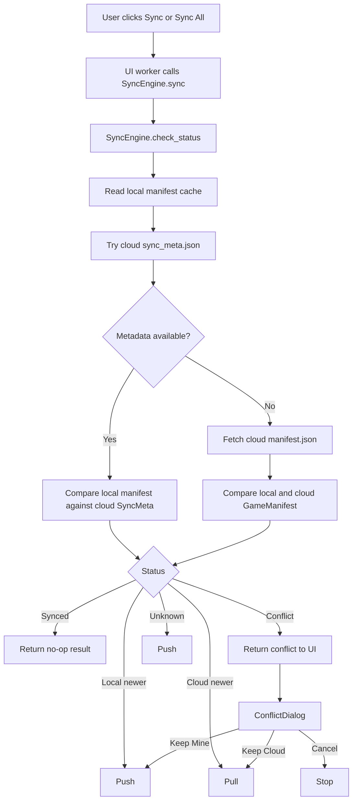
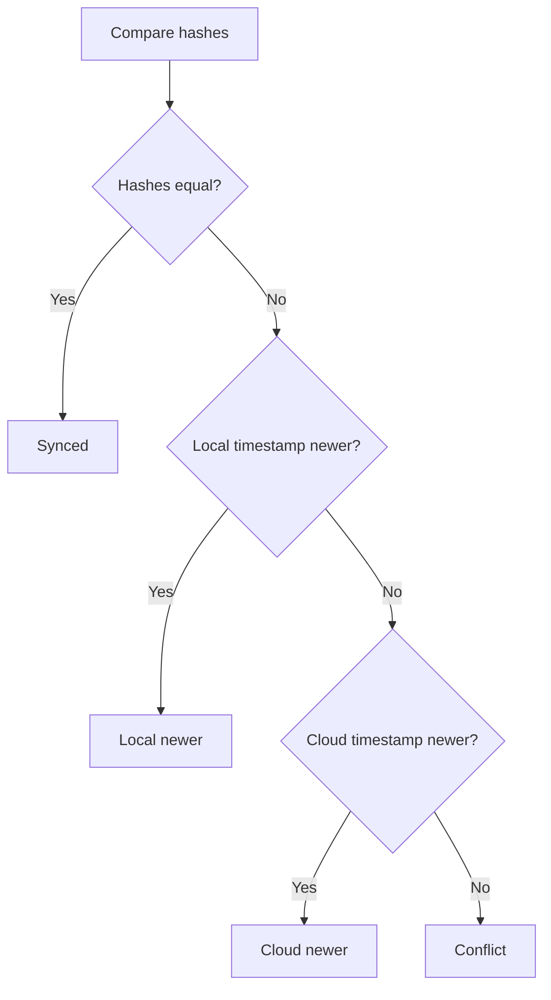
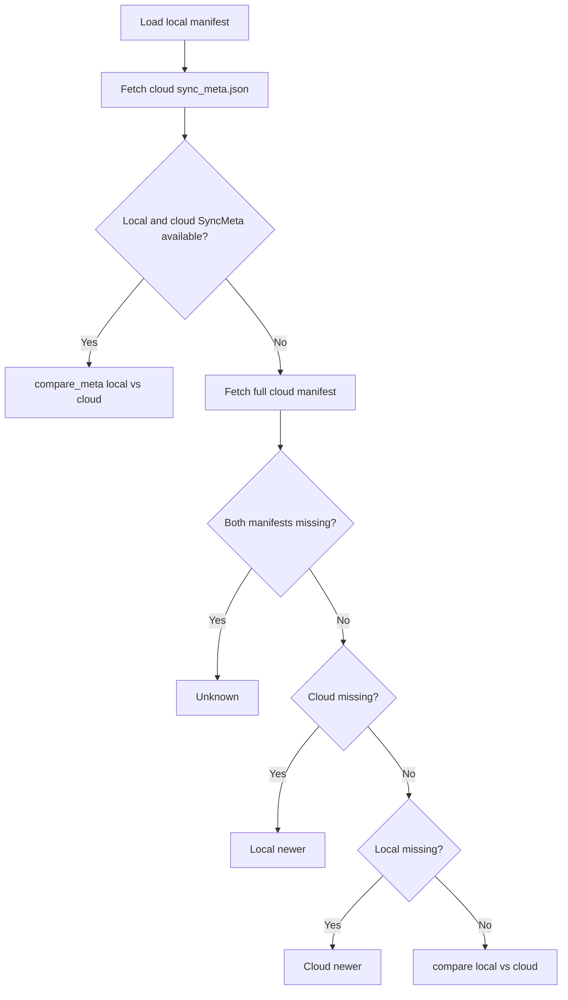
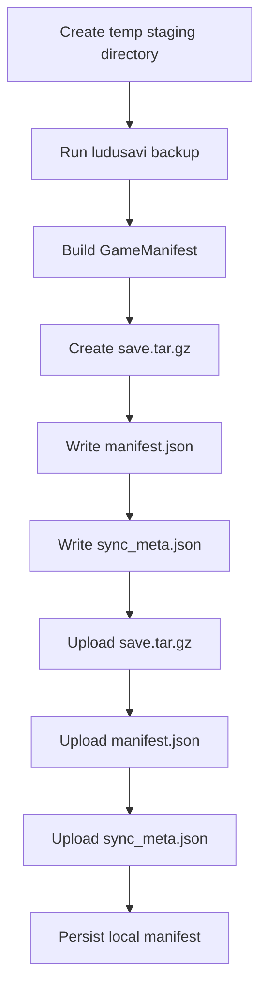
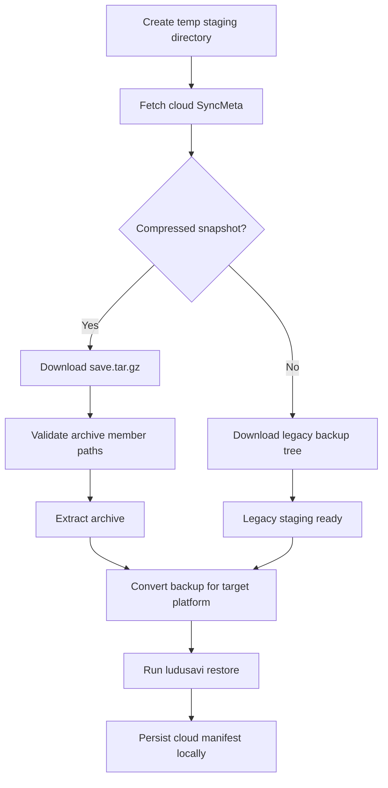
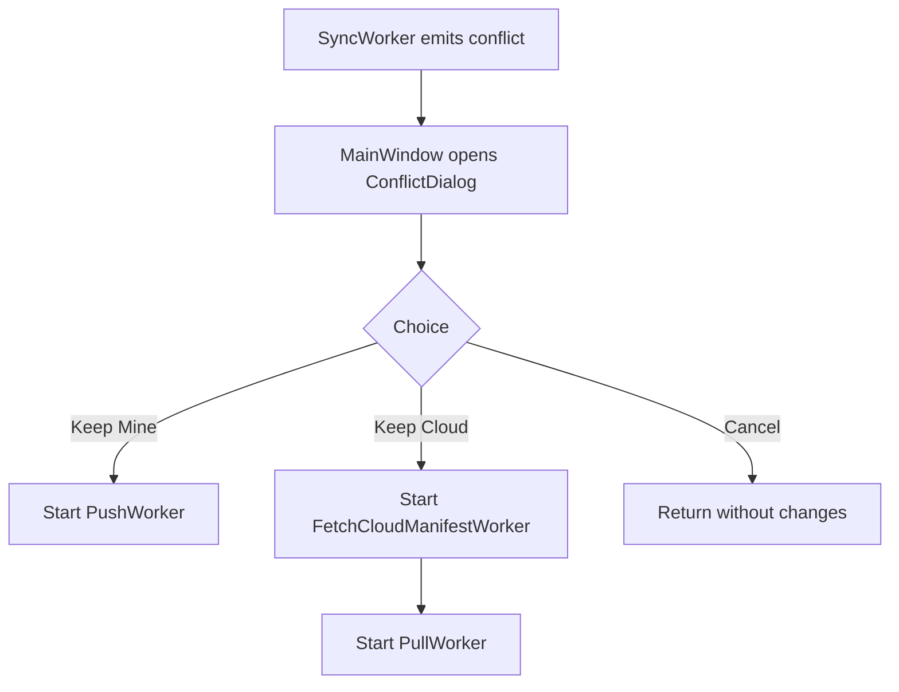

# SaveSync-Bridge Technical Documentation

This document describes the current implementation in the repository as of v0.3.1, with emphasis on the smart-sync pipeline, cloud storage format, background workers, and restore-time path conversion.

## Architecture Overview

High-level layers:

- UI layer: PySide6 windows, dialogs, widgets, and worker threads
- Orchestration layer: `SyncEngine`
- Tool adapters: `cli/ludusavi.py` and `cli/rclone.py`
- Persistence layer: config TOML, local manifest cache, cloud metadata files

Key modules:

- `src/savesync_bridge/ui/main_window.py`
- `src/savesync_bridge/ui/workers.py`
- `src/savesync_bridge/core/sync_engine.py`
- `src/savesync_bridge/core/backup_converter.py`
- `src/savesync_bridge/core/manifest.py`
- `src/savesync_bridge/models/game.py`

## End-To-End Sync Flow

The current app exposes a single sync action per game. The UI does not ask the user to choose push or pull up front.



## UI Flow And Workers

`MainWindow` coordinates user actions and launches background threads so the GUI stays responsive.

Worker roles:

- `ScanWorker`: runs `list_games()` and returns `LudusaviGame` records
- `SyncWorker`: runs `SyncEngine.sync()` for one or more games, emits progress and conflict events
- `PushWorker`: force-pushes one or more games after conflict resolution
- `PullWorker`: force-pulls one or more games after conflict resolution
- `FetchCloudManifestWorker`: downloads full cloud manifests before a forced pull
- `DriveConfigWorker`: performs Google Drive authentication, verification, reconnect, and token removal

The main window also:

- restores cached game cards on launch before scanning
- persists exclusion choices to `config.toml`
- attaches local manifests to games so cards can show last sync time
- updates the backup summary panel based on rclone remote config presence

## Data Model

### `GameManifest`

Represents a full game snapshot:

- `game_id`: Ludusavi game identifier
- `host`: `windows`, `linux`, or `steam_deck`
- `timestamp`: UTC time when SaveSync-Bridge created the manifest
- `hash`: SHA-256 digest over staged file contents
- `files`: tuple of `SaveFile`

Each `SaveFile` contains:

- `path`: relative path inside the staged backup
- `size`: bytes
- `modified`: filesystem modification time captured from the staged file

### `SyncMeta`

`SyncMeta` is a lightweight cloud-side record used for fast status checks without downloading the full manifest.

Fields:

- `game_id`
- `hash`
- `timestamp`
- `compressed`
- `archive_name`
- `total_size`

Current serialization writes `version: 2` into `sync_meta.json`.

## Manifest And Metadata Comparison

Comparison logic is implemented in `core/manifest.py`.

Rules for both `compare()` and `compare_meta()`:

1. Matching hashes return `SYNCED`.
2. Newer local timestamp returns `LOCAL_NEWER`.
3. Newer cloud timestamp returns `CLOUD_NEWER`.
4. Equal timestamps with different hashes return `CONFLICT`.



Important nuance:

- comparison is snapshot-level, not file-level
- `SaveFile.modified` is informational; it is not used to choose the winner

## `check_status()` Behavior

`SyncEngine.check_status(game_id)` now prefers the lightweight metadata path.

Flow:



The fast path is only used when both a local manifest and cloud `sync_meta.json` exist. Otherwise the engine falls back to the full-manifest path for compatibility with older snapshots.

## Push Pipeline

Implemented in `SyncEngine.push()`.

Sequence:

1. Create a temporary staging directory.
2. Create a per-game backup folder.
3. Run Ludusavi backup for exactly one game.
4. Walk staged files and build a `GameManifest`.
5. Compress the staged backup into `save.tar.gz`.
6. Write `manifest.json`.
7. Write `sync_meta.json`.
8. Upload archive and metadata files with rclone.
9. Save the full manifest locally.



Exact Ludusavi command:

```text
ludusavi backup --api --force --path <staging_game_dir> <game_name>
```

## Pull Pipeline

Implemented in `SyncEngine.pull()`.

Sequence:

1. Create a temporary staging directory.
2. Try to fetch cloud `sync_meta.json`.
3. If the snapshot is compressed, download `save.tar.gz` and extract it.
4. Otherwise fall back to legacy folder download.
5. Run restore-time backup conversion when platform mapping is needed.
6. Run Ludusavi restore.
7. Save the cloud manifest locally.



Exact Ludusavi command:

```text
ludusavi restore --api --force --path <staging_game_dir> <game_name>
```

The tar extraction path is validated to reject absolute paths and `..` traversal before extraction.

## Restore-Time Path Conversion

This is active in the current pipeline. `SyncEngine.pull()` calls `convert_simple_backup_for_restore()` before running Ludusavi restore.

The converter:

- locates the Ludusavi backup root and `mapping.yaml`
- rewrites stored file paths in the backup tree
- rewrites file-path keys inside `mapping.yaml`
- rebuilds drive-folder metadata when needed
- removes empty directories left behind after path moves

Conversion rules currently supported:

- Windows to Wine or Proton prefixes
- Wine or Proton prefixes back to Windows

This covers Steam compatdata prefixes and non-Steam titles as long as Ludusavi reports saves inside a Wine-style `drive_c` prefix.

## Conflict Resolution Logic

The engine reports `SyncStatus.CONFLICT`; the UI owns the resolution step.

Current mapping in `MainWindow`:

- `KEEP_LOCAL` triggers `_force_push_game()`
- `KEEP_CLOUD` triggers `_force_pull_game()`
- `KEEP_NEITHER` leaves state unchanged



Conflict resolution remains snapshot-level. No merge step exists.

## Manifest Hash Construction

`_build_manifest()`:

1. walks every staged file in sorted order
2. reads file bytes
3. updates one SHA-256 digest with file contents
4. records relative path, size, and modified time

Consequences:

- identical staged content produces identical hashes
- hashes are content-based
- file paths are not currently included in the digest input

## Local Persistence

### Config

Stored as TOML:

- Windows: `%APPDATA%/savesync-bridge/config.toml`
- Linux or Steam Deck: `~/.config/savesync-bridge/config.toml`

Current fields:

- `drive_remote`
- `drive_root`
- `backup_path`
- `drive_client_id`
- `drive_client_secret`
- `ludusavi_path`
- `rclone_path`
- `known_games`
- `excluded_games`

An app-owned `rclone.conf` file is stored beside `config.toml` and contains the saved Google Drive remote and OAuth token.

### Local state cache

Stored as per-game JSON manifests:

- Windows: `%LOCALAPPDATA%/savesync-bridge/states/<game_id>.json`
- Linux or Steam Deck: `~/.local/share/savesync-bridge/states/<game_id>.json`

These are metadata snapshots, not the actual save files.

## Cloud Persistence

Remote layout for each game:

```text
<backup_path>/<game_id>/
```

Current contents usually include:

- `save.tar.gz`
- `sync_meta.json`
- `manifest.json`

Legacy snapshots may instead contain the uncompressed Ludusavi backup tree plus `manifest.json`.

## CLI Adapter Behavior

### Ludusavi adapter

- `list_games()` -> `backup --preview --api`
- `backup_game()` -> `backup --api --force --path ...`
- `restore_game()` -> `restore --api --force --path ...`

`list_games()` uses preview mode to enumerate games currently visible on the machine rather than processing Ludusavi's full manifest database.

### rclone adapter

- `upload()` uses `copy` into the configured remote path
- `download()` uses `copy` from the configured remote path
- `read_file()` uses `cat`
- `list_files()` uses `lsjson`
- Google Drive auth helpers maintain the app-owned `rclone.conf`

The wrapper tracks active child processes and performs cleanup on exit.

## Debug Bus And Console

CLI wrappers emit best-effort events to `cli_bus`:

- command string
- stdout
- stderr
- exit code

`DebugPanel` renders those events in the main window. This is diagnostic only and does not influence sync decisions.

## Current Constraints And Risks

### 1. No true three-way merge

There is no stored base snapshot hash, so conflict handling is still two-sided and timestamp-based.

### 2. Snapshot-level replacement only

The unit of replacement is the whole game backup, not individual files.

### 3. Timestamp semantics are app-generated

Manifest timestamps are generated by SaveSync-Bridge when it writes metadata, not by the cloud provider.

### 4. `UNKNOWN` prefers push

If the engine lacks enough metadata to compare, it currently uploads the local machine's snapshot.

### 5. Native Linux saves are not remapped to Windows unless they live in Wine-style prefixes

Cross-platform conversion focuses on Windows and Wine or Proton layouts, not arbitrary native Linux save locations.

## Packaging Notes

The project uses PyInstaller:

- spec file: `savesync_bridge.spec`
- build command: `uv run build-exe`

`core/binaries.py` prefers bundled binaries under `src/savesync_bridge/bin/<platform>/` in development and under `sys._MEIPASS/bin/<platform>/` in frozen builds, falling back to `PATH` when needed.