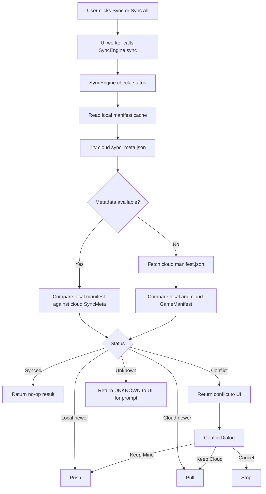
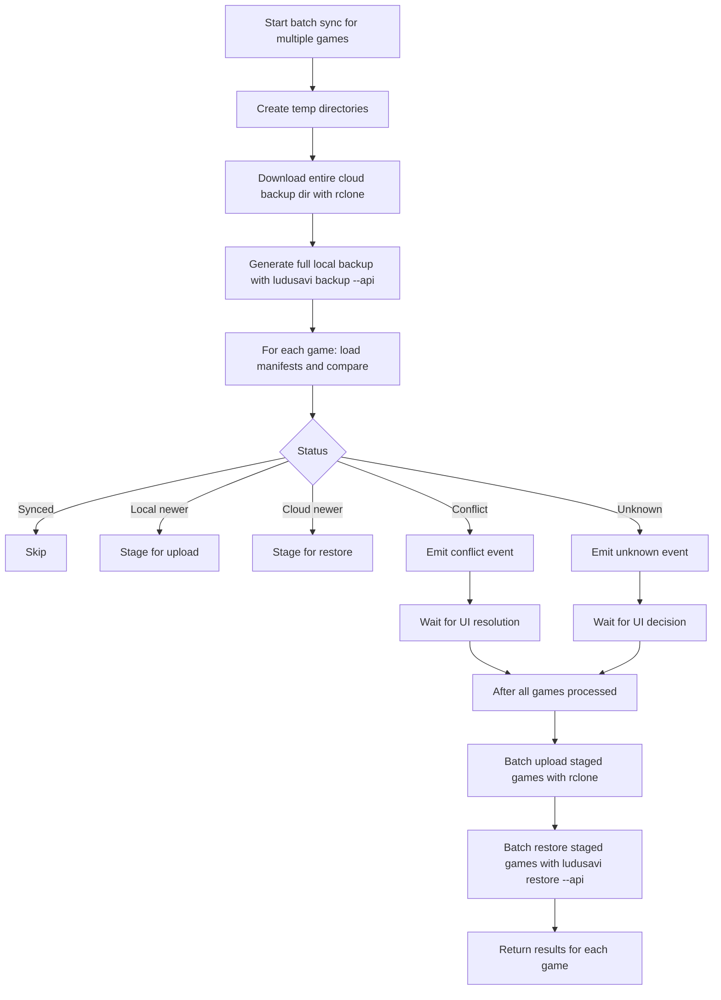
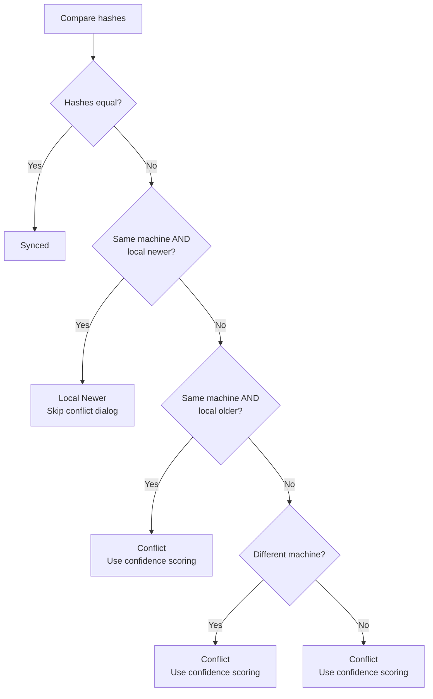
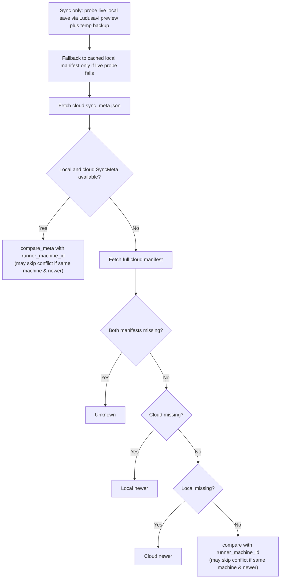
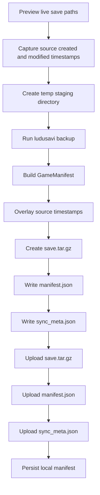
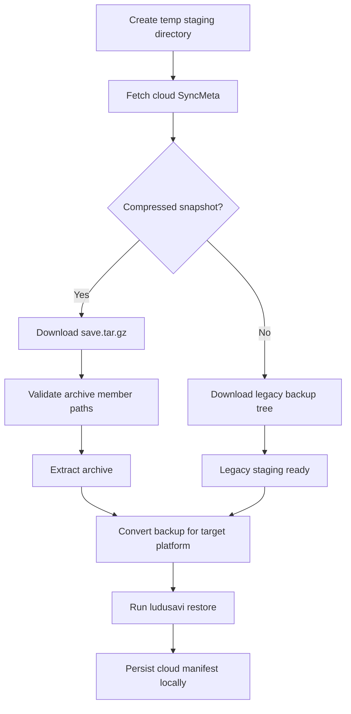
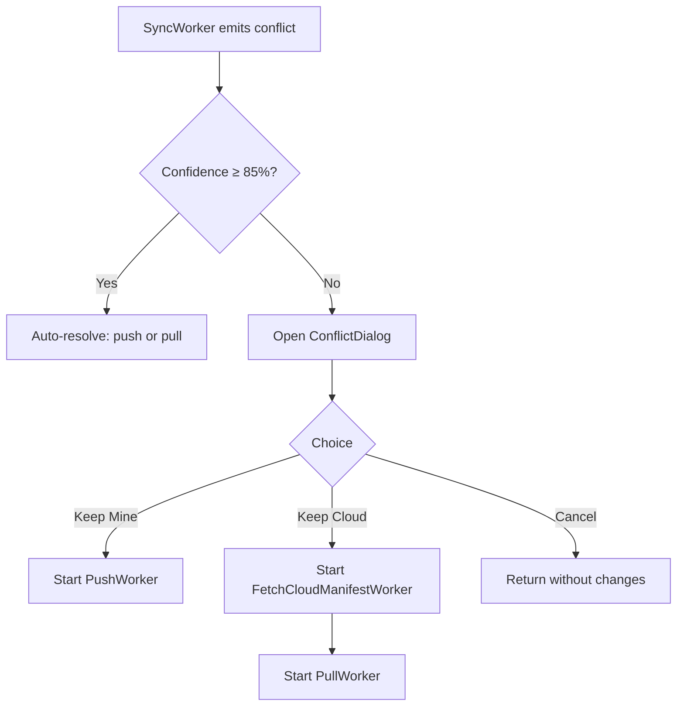

# SaveSync-Bridge Technical Documentation

This document describes the current implementation in the repository as of v0.6.0, with emphasis on the smart machine-ID sync optimization, smart-sync pipeline, cloud storage format, background workers, confidence scoring, per-file diffing, backup versioning, and restore-time path conversion.

## Architecture Overview

High-level layers:

- UI layer: PySide6 windows, dialogs, widgets, and worker threads
- Orchestration layer: `SyncEngine`
- Tool adapters: `cli/ludusavi.py` and `cli/rclone.py`
- Persistence layer: config TOML, local manifest cache, cloud metadata files

Key modules:

- `src/savesync_bridge/ui/main_window.py`
- `src/savesync_bridge/ui/workers.py`
- `src/savesync_bridge/core/sync_engine.py`
- `src/savesync_bridge/core/backup_converter.py`
- `src/savesync_bridge/core/manifest.py`
- `src/savesync_bridge/core/game_cache.py`
- `src/savesync_bridge/models/game.py`

## End-To-End Sync Flow

The current app exposes a single sync action per game. The UI does not ask the user to choose push or pull up front.



For single-game syncs, this flow applies. When syncing multiple games, the UI worker uses `SyncEngine.batch_sync_games()` for optimized batch processing.

## Batch Sync Flow

When `Sync All` or multiple games are selected, the app uses batch operations to minimize network I/O:



Key optimizations:

- Single bulk download of cloud data
- Single bulk local backup generation
- Local manifest comparisons without network calls
- Batched uploads and restores
- Verification of staged data before final operations

## UI Flow And Workers

`MainWindow` coordinates user actions and launches background threads so the GUI stays responsive.

Worker roles:

- `ScanWorker`: runs `list_games()` and returns `LudusaviGame` records
- `SyncWorker`: runs `SyncEngine.sync()` for one or more games, emits progress and conflict events
- `PushWorker`: force-pushes one or more games after conflict resolution
- `PullWorker`: force-pulls one or more games after conflict resolution
- `FetchCloudManifestWorker`: downloads full cloud manifests before a forced pull
- `DriveConfigWorker`: performs Google Drive authentication, verification, reconnect, and token removal

The main window also:

- restores cached game cards on launch before scanning
- persists exclusion choices to `config.toml`
- attaches local manifests to games so cards can show last sync time
- updates the backup summary panel based on rclone remote config presence

## Data Model

### `GameManifest`

Represents a full game snapshot:

- `game_id`: Ludusavi game identifier
- `host`: `windows`, `linux`, or `steam_deck`
- `timestamp`: UTC time when SaveSync-Bridge created the manifest
- `hash`: SHA-256 digest over staged file contents
- `files`: tuple of `SaveFile`

Each `SaveFile` contains:

- `path`: relative path inside the staged backup
- `size`: bytes
- `modified`: original save-file modification time when known, otherwise staged-file mtime
- `created`: original save-file creation time when the host filesystem exposes it
- `file_hash`: per-file SHA-256 digest for content-level comparison (new in v0.5.0)

### `SyncMeta`

`SyncMeta` is a lightweight cloud-side record used for fast status checks without downloading the full manifest.

Fields:

- `game_id`
- `hash`
- `timestamp`
- `compressed`
- `archive_name`
- `total_size`
- `machine_id`: identifier of the machine that created the snapshot (new in v0.5.0)

Current serialization writes `version: 2` into `sync_meta.json`.

## Manifest And Metadata Comparison

Comparison logic is implemented in `core/manifest.py`.

### Smart Machine ID Optimization (v0.6.0+)

Starting with v0.6.0, the comparison functions are **machine-aware**. When comparing local and cloud manifests, the engine checks if the local manifest originated from the current machine (`runner_machine_id` parameter).

**Smart sync decision tree:**



**Behavior:**

- **Same machine + local newer**: Returns `LOCAL_NEWER` immediately, **skipping conflict resolution entirely**. This is safe because:
  - The local save was just created or modified on this machine
  - It's provably newer than the cloud version
  - No meaningful data loss risk when overwriting older cloud state
  
- **Same machine + local older**: Returns `CONFLICT`, still uses confidence scoring. Timestamps alone are not trusted for auto-resolution (fresh game start or launcher touch can produce newer files with less progress).

- **Different machine or no machine ID**: Returns `CONFLICT`, uses full confidence scoring. Preserves existing cross-machine safety guarantees.

### Traditional Comparison Rules

For both `compare()` and `compare_meta()` (when machine ID check doesn't apply):

1. Matching hashes return `SYNCED`.
2. Any hash mismatch returns `CONFLICT`.

Important nuances:

- comparison is snapshot-level, not file-level
- timestamp ordering alone is not trusted for silent auto-resolution across machines
- `SaveFile.modified` and `SaveFile.created` are used for confidence scoring and user guidance, not for silent auto-resolution

## Confidence Scoring

When a conflict is detected, `compute_confidence()` in `core/manifest.py` produces a 0–1 score from six weighted signals:

| Signal | Weight | Description |
|--------|--------|-------------|
| Creation date gap | 25% | Larger gap between oldest file creation dates → higher confidence |
| Modification recency agreement | 20% | Does the most-recently-modified side match the lineage recommendation? |
| Per-file content match | 15% | Ratio of files with identical SHA-256 hashes between local and cloud (new in v0.5.0) |
| File count similarity | 10% | Similar file counts between local and cloud → more trustworthy |
| Size similarity | 10% | Large total-size divergence flags data loss risk |
| Directory scan corroboration | 20% | Does walking ALL files in the save directory confirm the recommendation? |

The score is capped at 0.3 when no clear lineage recommendation exists.

Threshold: **0.85** (high confidence). Above this, the engine auto-resolves the conflict without showing a dialog.

The `ConfidenceResult` dataclass carries:

- `score`: float 0.0–1.0
- `recommendation`: `"local"` or `"cloud"` or `None`
- `reasons`: tuple of human-readable explanation strings
- `safe_to_auto_sync`: boolean
- `label`: `"High"`, `"Medium"`, or `"Low"`

## Save Directory Scanning

`scan_save_directories()` in `core/sync_engine.py` walks ALL files in the save game directories reported by Ludusavi — not just the files Ludusavi maps to the staged backup. This provides a broader picture of file creation and modification times across the entire save directory tree.

The resulting `SaveDirStat` contains:

- `total_files`
- `oldest_created` / `newest_created`
- `oldest_modified` / `newest_modified`
- `total_size`

This data feeds into the directory scan corroboration signal of the confidence scorer.

## `check_status()` Behavior

`SyncEngine.check_status(game_id)` prefers the lightweight metadata path, and `SyncEngine.sync()` now refreshes live local state before making a sync decision. The machine ID from the current configuration is passed to comparison functions for smart sync optimization.

Flow:



The fast path is only used when both a local manifest and cloud `sync_meta.json` exist. Otherwise the engine falls back to the full-manifest path for compatibility with older snapshots.

Live local probing is intentionally conservative:

- a temporary Ludusavi backup is created to compute a fresh content hash using the same staged layout as cloud snapshots
- Ludusavi preview output supplies the original on-disk save paths
- original file `created` and `modified` timestamps are captured from those real save files and injected into the manifest for conflict guidance

**Machine ID Passing (v0.6.0+):**

`SyncEngine.check_status()` and `SyncEngine.sync()` pass `self._config.machine_name` as the `runner_machine_id` parameter to `compare()` and `compare_meta()`, enabling the smart sync optimization described above.

## Push Pipeline

Implemented in `SyncEngine.push()`.

Sequence:

1. Create a temporary staging directory.
2. Query Ludusavi preview for the game's real save paths.
3. Capture original file timestamps from those real save files.
4. Create a per-game backup folder.
5. Run Ludusavi backup for exactly one game.
6. Walk staged files and build a `GameManifest`.
7. Overlay original file timestamps onto matching staged save entries.
8. Compress the staged backup into `save.tar.gz`.
9. Write `manifest.json`.
10. Write `sync_meta.json`.
11. Upload archive and metadata files with rclone.
12. Save the full manifest locally.



Exact Ludusavi command:

```text
ludusavi backup --api --force --path <staging_game_dir> <game_name>
```

## Pull Pipeline

Implemented in `SyncEngine.pull()`.

Sequence:

1. Create a temporary staging directory.
2. Try to fetch cloud `sync_meta.json`.
3. If the snapshot is compressed, download `save.tar.gz` and extract it.
4. Otherwise fall back to legacy folder download.
5. Run restore-time backup conversion when platform mapping is needed.
6. Run Ludusavi restore.
7. Save the cloud manifest locally.



Exact Ludusavi command:

```text
ludusavi restore --api --force --path <staging_game_dir> <game_name>
```

The tar extraction path is validated to reject absolute paths and `..` traversal before extraction.

## Restore-Time Path Conversion

This is active in the current pipeline. `SyncEngine.pull()` calls `convert_simple_backup_for_restore()` before running Ludusavi restore.

The converter:

- locates the Ludusavi backup root and `mapping.yaml`
- rewrites stored file paths in the backup tree
- rewrites file-path keys inside `mapping.yaml`
- rebuilds drive-folder metadata when needed
- removes empty directories left behind after path moves

Conversion rules currently supported:

- Windows to Wine or Proton prefixes
- Wine or Proton prefixes back to Windows

This covers Steam compatdata prefixes and non-Steam titles as long as Ludusavi reports saves inside a Wine-style `drive_c` prefix.

## Conflict Resolution Logic

The engine reports `SyncStatus.CONFLICT`; the UI owns the resolution step.

When a conflict is detected, the sync engine:

1. Scans ALL files in the save directory tree via `scan_save_directories()`.
2. Computes a `ConfidenceResult` using manifest metadata plus directory scan data.
3. Returns the confidence alongside the conflict status.

The `MainWindow` then decides:

- **High confidence** (score ≥ 0.85): auto-resolves by pushing or pulling based on the recommendation, without showing a dialog.
- **Medium or Low confidence**: opens the `ConflictDialog` for manual review.

The dialog shows:

- snapshot capture time, oldest known file creation time, latest file modification time
- per-file created/modified timestamps for up to 3 files on each side
- confidence score with label and all reasoning bullets
- a recommendation when one side clearly looks like the older-established save lineage
- preselected default button matching the recommendation

Current mapping in `MainWindow`:

- `KEEP_LOCAL` triggers `_force_push_game()`
- `KEEP_CLOUD` triggers `_force_pull_game()`
- `KEEP_NEITHER` leaves state unchanged



Conflict resolution remains snapshot-level. No merge step exists.

## Manifest Hash Construction

`_build_manifest()`:

1. walks every staged file in sorted order
2. reads file bytes
3. updates one SHA-256 digest with file contents (manifest-level hash)
4. computes per-file SHA-256 hash for each file
5. records relative path, size, modified time, created time, and per-file hash

Consequences:

- identical staged content produces identical manifest hashes
- manifest hashes are content-based
- per-file hashes enable detecting metadata-only changes (timestamps differ but content identical)
- file paths are not included in the digest input

## Local Persistence

### Config

Stored as TOML:

- Windows: `%APPDATA%/savesync-bridge/config.toml`
- Linux or Steam Deck: `~/.config/savesync-bridge/config.toml`

Current fields:

- `drive_remote`
- `drive_root`
- `backup_path`
- `drive_client_id`
- `drive_client_secret`
- `ludusavi_path`
- `rclone_path`
- `known_games`
- `excluded_games`
- `machine_name`: human-readable name for the current machine (new in v0.5.0)
- `max_versions`: number of backup versions to retain in cloud (default 3, new in v0.5.0)

An app-owned `rclone.conf` file is stored beside `config.toml` and contains the saved Google Drive remote and OAuth token.

### Local state cache

Stored as per-game JSON manifests:

- Windows: `%LOCALAPPDATA%/savesync-bridge/states/<game_id>.json`
- Linux or Steam Deck: `~/.local/share/savesync-bridge/states/<game_id>.json`

These are metadata snapshots, not the actual save files.

## Cloud Persistence

Remote layout for each game:

```text
<backup_path>/<game_id>/
```

Current contents usually include:

- `save.tar.gz`
- `sync_meta.json`
- `manifest.json`
- `.lock` (transient, during active sync operations)
- `versions/v1/`, `versions/v2/`, etc. (backup version history)

Legacy snapshots may instead contain the uncompressed Ludusavi backup tree plus `manifest.json`.

## CLI Adapter Behavior

### Ludusavi adapter

- `list_games()` -> `backup --preview --api`
- `backup_game()` -> `backup --api --force --path ...`
- `restore_game()` -> `restore --api --force --path ...`

`list_games()` uses preview mode to enumerate games currently visible on the machine rather than processing Ludusavi's full manifest database.

### rclone adapter

- `upload()` uses `copy` into the configured remote path
- `download()` uses `copy` from the configured remote path
- `read_file()` uses `cat`
- `list_files()` uses `lsjson`
- Google Drive auth helpers maintain the app-owned `rclone.conf`

The wrapper tracks active child processes and performs cleanup on exit.

## Debug Bus And Console

CLI wrappers emit best-effort events to `cli_bus`:

- command string
- stdout
- stderr
- exit code

`DebugPanel` renders those events in the main window. This is diagnostic only and does not influence sync decisions.

## Current Constraints And Risks

### 1. No true three-way merge

There is no stored base snapshot hash, so conflict handling is still two-sided. Confidence scoring uses multiple heuristic signals rather than a deterministic common-ancestor comparison.

### 2. Snapshot-level replacement only

The unit of replacement is the whole game backup, not individual files.

### 3. Timestamp semantics are app-generated

Manifest timestamps are generated by SaveSync-Bridge when it writes metadata, not by the cloud provider.

### 4. `UNKNOWN` prompts the user

If the engine lacks enough metadata to compare, it returns `UNKNOWN` to the UI, which shows a dialog asking the user whether to push or cancel.

### 5. Native Linux saves are not remapped to Windows unless they live in Wine-style prefixes

Cross-platform conversion focuses on Windows and Wine or Proton layouts, not arbitrary native Linux save locations.

## Per-File Hashing And Diff (v0.5.0)

Each `SaveFile` now carries a `file_hash` field — the SHA-256 digest of that individual file. These hashes are computed during `_build_manifest()` and serialized into both `manifest.json` and the local cache.

### Per-file diff

`diff_manifests(local, cloud)` returns a `ManifestDiff` containing:

- `entries`: list of `FileDiffEntry`, one per file with status `unchanged` / `modified` / `added_local` / `added_cloud`
- Summary counts: `unchanged_count`, `modified_count`, `added_local_count`, `added_cloud_count`, `total_files`

Comparison priority: if both files have `file_hash`, compare hashes; otherwise fall back to size comparison.

The conflict dialog renders this diff as a color-coded scrollable panel.

### Content-match confidence signal

The per-file content match ratio is used as Signal 3 (15% weight) in `compute_confidence()`. A high match ratio indicates metadata-only changes (e.g., file modification timestamps updated without actual content changes), reducing false-positive conflicts.

## Machine Identity (v0.5.0)

`GameManifest` and `SyncMeta` now carry a `machine_id` field. `AppConfig` stores a `machine_name` that is embedded in manifests during push.

When `machine_name` is not configured, the app now generates a stable default machine identifier from the host name or hardware-derived ID.

Machine identity is visible in:

- the conflict dialog (shows which machine created each snapshot)
- game cards (shows the last syncing machine)

## Backup Versioning (v0.5.0)

Before each push, `_rotate_versions()` copies the current cloud files (`save.tar.gz`, `manifest.json`, `sync_meta.json`) into a `versions/v<N>/` subdirectory. Older versions beyond `config.max_versions` (default 3) are pruned.

This allows recovery of previous snapshots if a bad push overwrites data.

## Cloud Lock File (v0.5.0)

A transient `.lock` file is uploaded to the cloud game prefix during push and pull operations. The lock contains the machine name and a UTC timestamp.

Behavior:

- If a fresh lock exists (< 5 minutes), `_acquire_lock()` raises `SyncError` to prevent concurrent modification.
- Stale locks (> 5 minutes) are overridden with a warning.
- The lock is released after the operation completes (success or failure).

## Sync History (v0.5.0)

Each push and pull appends a `SyncHistoryEntry` to a JSON file at `<state_dir>/sync_history.json`. The history records:

- `timestamp`, `game_id`, `action` (push/pull), `machine_id`, `confidence`, `error`

The history file retains the last 500 entries.

## Integrity Verification (v0.5.0)

`verify_cloud_integrity(game_id)` fetches both the cloud `manifest.json` and `sync_meta.json`, then compares their hashes. Returns `(ok, message)`.

Accessible from the game card context menu.

## Export / Import Library (v0.5.0)

- `export_library(dest, game_ids)`: downloads cloud saves for the specified games (or all) and bundles them into a single ZIP file.
- `import_library(src, game_ids)`: extracts games from a ZIP and uploads them back to cloud.
- `list_cloud_games()`: lists game IDs with saves in the cloud via `rclone lsjson`.

## Retry Logic (v0.5.0)

`_retry_rclone(func, attempts=3)` wraps rclone operations with exponential backoff (1s, 2s, 4s). Transient network errors are retried; permanent failures propagate.

## Stale Game Cache (v0.5.0)

`prune_stale_games(games)` in `core/game_cache.py` removes games whose save paths no longer exist on disk. Games with no save paths (cloud-only entries) are kept. Returns `(active_games, pruned_game_ids)`.

## Packaging Notes

The project uses PyInstaller:

- spec file: `savesync_bridge.spec`
- build command: `uv run build-exe`

`core/binaries.py` prefers bundled binaries under `src/savesync_bridge/bin/<platform>/` in development and under `sys._MEIPASS/bin/<platform>/` in frozen builds, falling back to `PATH` when needed.