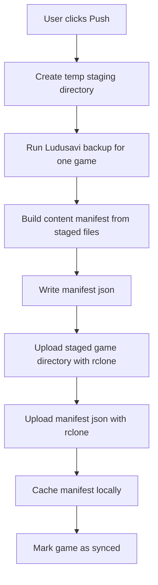
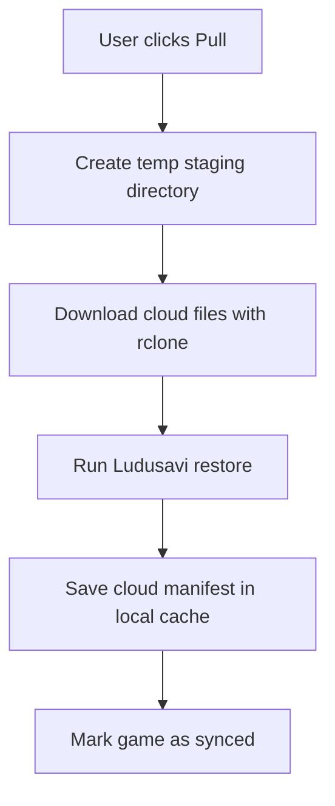
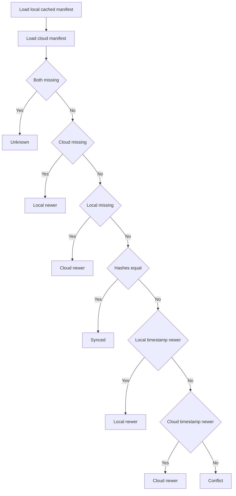

# SaveSync-Bridge User Guide

SaveSync-Bridge is a desktop app for moving game saves between your current machine and cloud storage using bundled Ludusavi and rclone binaries.

The app makes decisions at the game level, not at the individual-file level. When you push or pull a game, the whole saved-game snapshot for that game is uploaded or restored.

## What The App Does

SaveSync-Bridge combines three things:

- Ludusavi discovers save files and performs backup and restore operations.
- rclone uploads and downloads those backup files to S3-compatible storage.
- SaveSync-Bridge stores a local manifest per game so it can decide whether your local copy or the cloud copy should win.

## Core Model

For each game, the app tracks one of these states:

- `Synced`: local and cloud content hashes match.
- `Local Newer`: the local cached snapshot is newer than the cloud snapshot.
- `Cloud Newer`: the cloud snapshot is newer than the local cached snapshot.
- `Conflict`: local and cloud timestamps are equal, but hashes differ.
- `Unknown`: the app cannot decide yet, or a required snapshot is missing.

## Setup

## 1. Configure credentials

The app loads `.env` from the current working directory on startup. Typical keys are:

```env
RCLONE_CONFIG_S3_TYPE=s3
RCLONE_CONFIG_S3_PROVIDER=AWS
RCLONE_CONFIG_S3_ACCESS_KEY_ID=...
RCLONE_CONFIG_S3_SECRET_ACCESS_KEY=...
RCLONE_CONFIG_S3_REGION=...
RCLONE_CONFIG_S3_ENDPOINT=...
```

If your rclone remote is fully configured elsewhere, you may not need all of these variables.

## 2. Configure app settings

Open `Settings` in the app and fill in:

- `rclone Remote Name`: the remote name rclone should use, such as `s3remote`
- `S3 Bucket`: your target bucket
- `S3 Prefix / Path`: top-level folder used by SaveSync-Bridge inside the bucket
- `Ludusavi Binary`: optional override; leave empty to use the bundled binary
- `Rclone Binary`: optional override; leave empty to use the bundled binary

The configuration file is stored here:

- Windows: `%APPDATA%/savesync-bridge/config.toml`
- Linux / Steam Deck: `$XDG_CONFIG_HOME/savesync-bridge/config.toml` or `~/.config/savesync-bridge/config.toml`

## Daily Workflow

## Refresh All

`Refresh All` runs Ludusavi in preview mode to detect games currently installed on this machine.

Command used:

```text
ludusavi backup --preview --api
```

This returns only games Ludusavi can currently find save data for. It does not scan the cloud.

## Push All / Push One Game

`Push` means: back up the current machine's save files for a game, compute a manifest for that backup, and upload both to the cloud.

Flow:



Important behavior:

- The app does not upload raw live save files directly from their original locations.
- It first asks Ludusavi to create a staged backup for the selected game.
- The uploaded cloud snapshot is whatever Ludusavi wrote into that staging directory.

## Pull One Game

`Pull` means: download the saved snapshot from the cloud into a temp folder, then ask Ludusavi to restore it onto this machine.

Flow:



Important behavior:

- Pull is also whole-game, not per-file.
- SaveSync-Bridge does not choose individual files to restore.
- When a snapshot moves between Windows and a Wine or Proton prefix, SaveSync-Bridge rewrites the downloaded Ludusavi backup to the current machine's absolute-path layout before restore.
- Ludusavi then performs the actual restore step and applies the rewritten backup to the machine.

This works for Steam games and for non-Steam titles as long as Ludusavi discovers their Linux save path inside a Wine-style prefix ending in `drive_c`.

## How The App Decides Which Side Wins

The app compares two manifests:

- The local cached manifest from the last successful push or pull on this machine
- The cloud manifest stored as `manifest.json` beside the uploaded save snapshot

Decision flow:



## What “Newer” Means

“Newer” does not mean the newest individual file wins.

It means the newer manifest timestamp wins:

- During `push`, SaveSync-Bridge creates a new manifest with the current UTC timestamp.
- During `pull`, it caches the cloud manifest locally.
- During comparison, if the content hashes differ, the app compares those manifest timestamps.

So the decision is snapshot-based, not file-by-file.

## What Gets Replaced

This is the most important behavior to understand:

- SaveSync-Bridge does not merge saves file-by-file.
- SaveSync-Bridge does not select the newest file inside a game save directory.
- SaveSync-Bridge chooses one full snapshot of a game.
- If local wins, the app performs a full push.
- If cloud wins, the app performs a full pull.

If you expected a partial merge, that is not how the current implementation works.

## Conflict Handling

A conflict happens when:

- local and cloud hashes are different, and
- local and cloud manifest timestamps are equal

When that happens, the conflict dialog shows both sides and gives you three choices:

- `Keep Mine`: run a full push of the local snapshot
- `Keep Cloud`: run a full pull of the cloud snapshot
- `Cancel`: do nothing

No automatic merge is attempted.

## Debug Console

The bottom debug console shows:

- every Ludusavi command
- every rclone command
- stdout and stderr emitted by those tools
- final exit status for each command

Use it when:

- a game does not appear during refresh
- credentials or bucket settings are wrong
- Ludusavi cannot restore or back up a title
- you need to see the exact CLI behavior

## Cloud Layout

Within your configured bucket and prefix, each game is stored under:

```text
<s3_prefix>/<game_id>/
```

That folder contains:

- the backup files created by Ludusavi
- `manifest.json`

## Local State Layout

The app keeps one cached manifest per game locally so it can decide future sync direction.

State directory:

- Windows: `%LOCALAPPDATA%/savesync-bridge/states/`
- Linux / Steam Deck: `$XDG_DATA_HOME/savesync-bridge/states/` or `~/.local/share/savesync-bridge/states/`

These files are not the actual saves. They are metadata snapshots used for sync decisions.

## Known Limits

- Sync decisions are based on manifests, not live comparison of both machines at the same time.
- The app currently resolves at the game level, not the file level.
- Cross-environment conversion is currently implemented for Windows and Wine-prefix saves, including non-Steam launchers when Ludusavi reports paths under `drive_c`. Native Linux save layouts that do not live inside a Wine prefix are not remapped to Windows.

## Build And Run

Development run:

```bash
uv run savesync-bridge
uv run app
```

Standalone build:

```bash
uv run build-exe
```

On Windows, this produces:

```text
dist/SaveSync-Bridge.exe
```