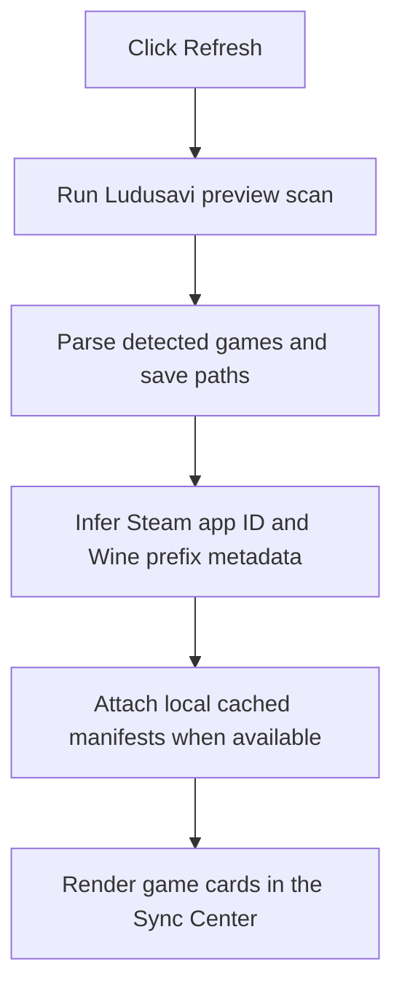
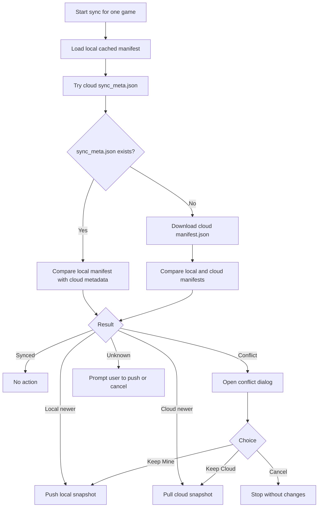
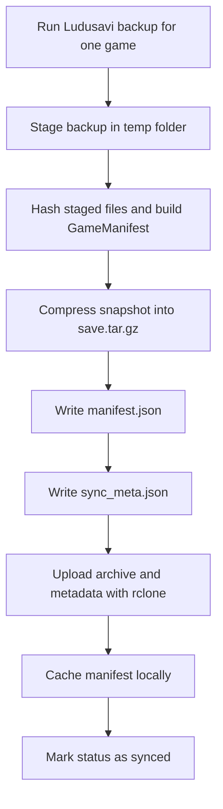
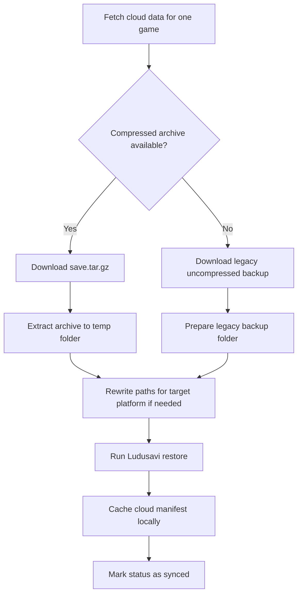
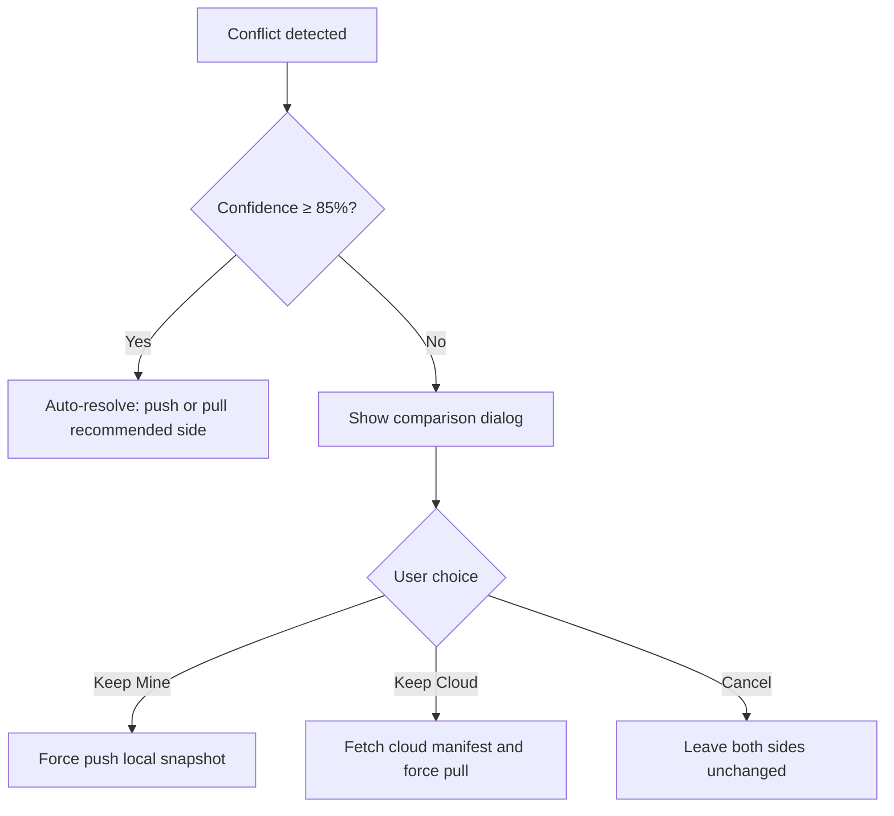

# SaveSync-Bridge User Guide

SaveSync-Bridge is a desktop app for syncing game saves between the current machine and Google Drive by combining Ludusavi, rclone, and a small amount of sync metadata.

The important rule is simple: the app syncs one whole game snapshot at a time. It does not merge individual files inside a save.

## What The Main Window Shows

The current UI is a Sync Center with these main areas:

- `Refresh` rescans games visible to Ludusavi on the current machine
- `Sync All` runs smart sync for every non-excluded game
- each game card shows last sync time, last sync date, file created/modified dates, confidence score, machine identity, storage size, current status, an exclusion checkbox, and one `Sync` button
- right-click any game card for a context menu with Smart Sync, Force Push, Force Pull, Verify Integrity, and Exclude/Include
- the left sidebar filters the list by `All Games`, `Local Newer`, `Conflicts`, `Synced`, and `Excluded`
- a sort dropdown lets you order games by name (A-Z or Z-A), last synced time, or status
- the `Backup Destination` panel summarizes the active Google Drive target
- the debug console shows exact CLI commands and output from Ludusavi and rclone

## Status Meanings

Each game ends up in one of these states:

- `Synced`: local and cloud hashes match
- `Local Newer`: local metadata is newer than the cloud copy
- `Cloud Newer`: cloud metadata is newer than the local copy
- `Conflict`: hashes differ and the app cannot safely pick a side automatically
- `Unknown`: the app does not have enough metadata yet, or a sync failed

## Confidence Scoring

When both local and cloud saves exist, the app computes a confidence score (0–100%) that indicates how certain it is about which side to keep.

The score is built from:

- how far apart the oldest file creation dates are
- whether the most-recently-modified side matches the recommended lineage
- per-file content comparison using SHA-256 hashes (detects metadata-only changes that don't affect actual save data)
- how similar the file counts and total sizes are between both sides
- whether a full scan of ALL files in the save directory confirms the recommendation

**Note**: If all files have identical content despite different timestamps, the app treats this as synced and skips the conflict dialog entirely.

The confidence label appears on each game card:

- **High** (green, ≥ 85%): the app is confident and will auto-resolve conflicts without asking
- **Medium** (yellow, 55–84%): the app has a suggestion but will always ask before replacing files
- **Low** (red, < 55%): the app is uncertain and will always ask

The conflict dialog shows the full confidence breakdown with individual reasoning bullets so you can make an informed decision.

## File Dates On Game Cards

Each game card now displays:

- **Created**: the oldest known file creation date from your local save files
- **Modified**: the most recent file modification date

These dates come from the actual save files on disk, not from when SaveSync-Bridge last synced.

## Setup

## 1. Connect Google Drive

Open `Backups` from the toolbar or the `Manage Backups` button.

The dialog controls:

- `Drive Remote Name`: rclone remote name, default `gdrive`
- `Drive Folder`: optional top-level folder in Google Drive
- `Backup Library`: folder under that Drive location where SaveSync-Bridge stores game snapshots
- `Google Client ID` and `Google Client Secret`: optional custom OAuth app credentials
- `Ludusavi Binary`: optional override path if you do not want the bundled binary
- `Rclone Binary`: optional override path if you do not want the bundled binary

The dialog actions are:

- `Authenticate Google Drive`: start browser-based sign-in and save the token
- `Check Connection`: verify the saved token and current path
- `Refresh Sign-In`: refresh an expired or revoked token
- `Remove Saved Token`: delete the token for the current remote

Most users do not need a `.env` file. If you created your own Google OAuth desktop app, you can provide its client ID and secret directly in the dialog.

Config storage:

- Windows: `%APPDATA%/savesync-bridge/config.toml`
- Linux or Steam Deck: `~/.config/savesync-bridge/config.toml`

Saved token storage:

- Windows: `%APPDATA%/savesync-bridge/rclone.conf`
- Linux or Steam Deck: `~/.config/savesync-bridge/rclone.conf`

## 2. Refresh Your Local Game List

`Refresh` scans only the current machine. It does not browse Google Drive for game names.

Command used:

```text
ludusavi backup --preview --api
```

Flow:



## Daily Sync Workflow

The normal workflow is:

1. Refresh the local game list.
2. Review status badges and exclusions.
3. Click `Sync` on one game or `Sync All` for everything not excluded.
4. Resolve conflicts only when the app asks.

## How Smart Sync Works

This is the core flow used by both the per-game `Sync` button and `Sync All`.



### Why `Unknown` shows a prompt

If neither side has enough metadata to compare, SaveSync-Bridge shows a dialog asking whether to push the local save to the cloud or cancel. This prevents accidental overwrites on first sync.

## What A Push Actually Does

Push means creating a fresh staged backup on the current machine and uploading that snapshot.



Important details:

- the app acquires a cloud lock to prevent concurrent syncs from other machines
- previous cloud snapshots are rotated into versioned backups before overwriting
- the app uploads Ludusavi's staged backup, not raw live files directly from their original folders
- cloud storage now prefers a compressed archive plus metadata
- `manifest.json` is still uploaded for backward compatibility and restore logic
- rclone operations are retried with exponential backoff on transient network errors

## What A Pull Actually Does

Pull means downloading the saved cloud snapshot, adapting it if the platform changed, then restoring it through Ludusavi.



Cross-platform restore works when the save paths are inside a Wine-style `drive_c` prefix. That includes Steam compatdata prefixes and non-Steam launchers like Heroic or Lutris when Ludusavi reports their paths under `drive_c`.

## Conflict Handling

A conflict happens when local and cloud save contents differ (different hashes).

When a conflict is detected:

- If confidence is **High** (≥ 85%), the app auto-resolves by pushing or pulling the recommended side. No dialog is shown.
- If confidence is **Medium** or **Low**, the app opens a side-by-side comparison dialog.

The conflict dialog shows:

- snapshot times, oldest file creation dates, and latest modification dates for both sides
- the machine identity that created each snapshot
- per-file timestamps (created and modified) for up to 3 files on each side
- a per-file diff panel showing which files are unchanged, modified, added locally, or added in cloud (color-coded)
- confidence score with label and reasoning
- a recommendation when one side clearly has the older-established save lineage
- the recommended action is preselected as the default button



No automatic merge is attempted. The replacement unit is always the whole game backup.

## What “Newer” Means

“Newer” is manifest-level, not file-level.

That means:

- SaveSync-Bridge compares content hashes and timestamps at the snapshot level
- individual file modification times are used for confidence scoring and user guidance, not for choosing a winner
- if hashes differ, the result is always a conflict (never a silent overwrite)

## What Gets Replaced

This is the key behavior:

- the app never merges save files one-by-one
- a push replaces the cloud snapshot for that game
- a pull replaces the local snapshot for that game through Ludusavi restore
- the replacement unit is the whole staged backup for one game
- **metadata-only changes** (timestamps differ but file content is identical) are automatically resolved without prompting

## Excluding Games

Each game card has an exclusion checkbox.

- excluded games stay in the list
- excluded games appear under the `Excluded` filter
- excluded games are skipped by `Sync All`
- the exclusion list is saved in `config.toml` under `excluded_games`

## Debug Console

Use the debug console when:

- a game is missing from refresh results
- Google Drive authentication looks wrong
- cloud path settings are incorrect
- Ludusavi fails to back up or restore a title
- you need to inspect the exact CLI commands and stderr output

The panel shows the command, stdout, stderr, and exit code for Ludusavi and rclone operations.

## Cloud Layout

Each game is stored under:

```text
<backup_path>/<game_id>/
```

Current cloud format normally includes:

- `save.tar.gz`
- `sync_meta.json`
- `manifest.json`
- `.lock` (transient, present only during active sync operations)
- `versions/v1/`, `versions/v2/`, etc. (previous snapshots, up to `max_versions`)

Older snapshots may still contain an uncompressed Ludusavi backup layout instead of `save.tar.gz`.

## Local State Layout

The app keeps a cached manifest per game in:

- Windows: `%LOCALAPPDATA%/savesync-bridge/states/`
- Linux or Steam Deck: `~/.local/share/savesync-bridge/states/`

These files are sync metadata, not the actual game saves.

## Known Limits

- sync decisions are based on cached metadata, not a live three-way merge
- sync is game-level, not file-level
- native Linux save layouts outside Wine or Proton prefixes are not remapped into Windows paths
- `Unknown` now prompts the user instead of auto-pushing

## New In v0.5.0

- **Per-file SHA-256 hashes**: reduces false positive conflicts from metadata-only changes
- **Machine identity**: see which machine last synced each game
- **Per-file diff in conflict dialog**: color-coded comparison of individual files
- **Backup versioning**: previous cloud snapshots are kept (configurable, default 3)
- **Cloud lock file**: prevents concurrent sync corruption from multiple machines
- **Sync history log**: records all push/pull operations with timestamps and outcomes
- **Integrity verification**: check cloud archive consistency from the context menu
- **Export/Import**: bulk download or restore cloud saves as a ZIP file
- **Context menu**: right-click game cards for Force Push, Force Pull, Verify, Exclude
- **Sorting**: order games by name, last synced, or status
- **UNKNOWN prompt**: no longer auto-pushes, asks before creating first cloud snapshot
- **Retry logic**: transient rclone errors are retried with exponential backoff
- **Stale cache pruning**: games with missing save paths are detected and cleaned up

## Build And Run

```bash
uv sync
uv run savesync-bridge
```

Standalone build:

```bash
uv run build-exe
```

Windows output:

```text
dist/SaveSync-Bridge.exe
```