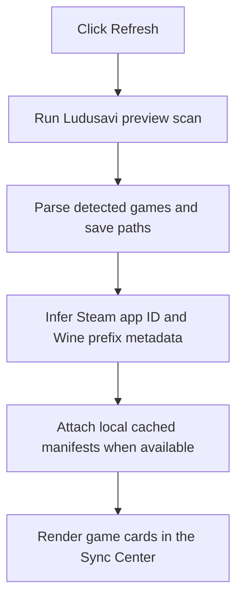
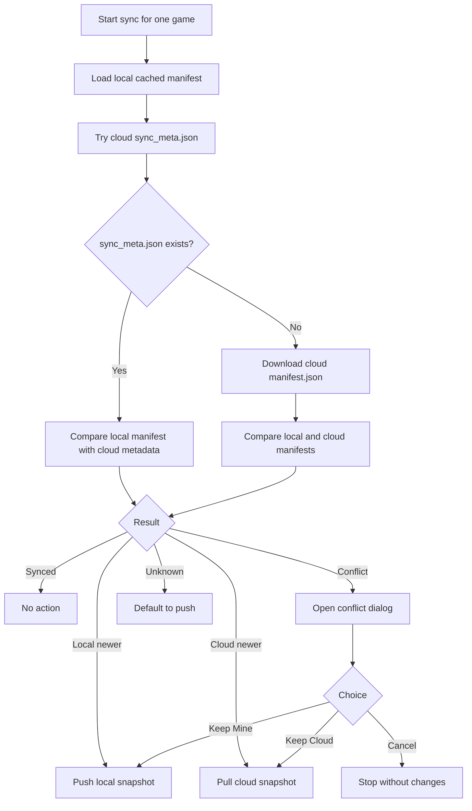
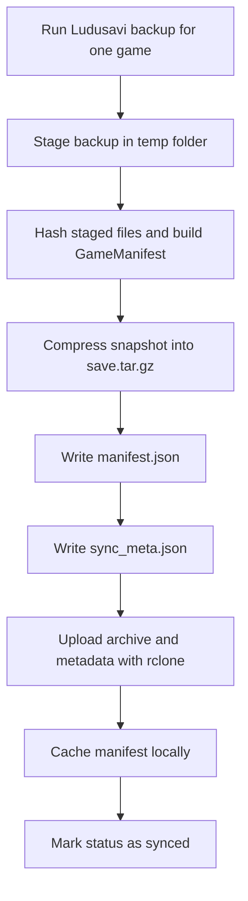
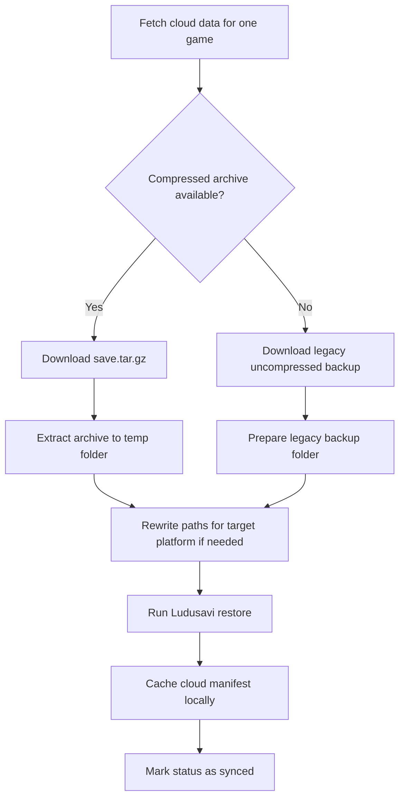
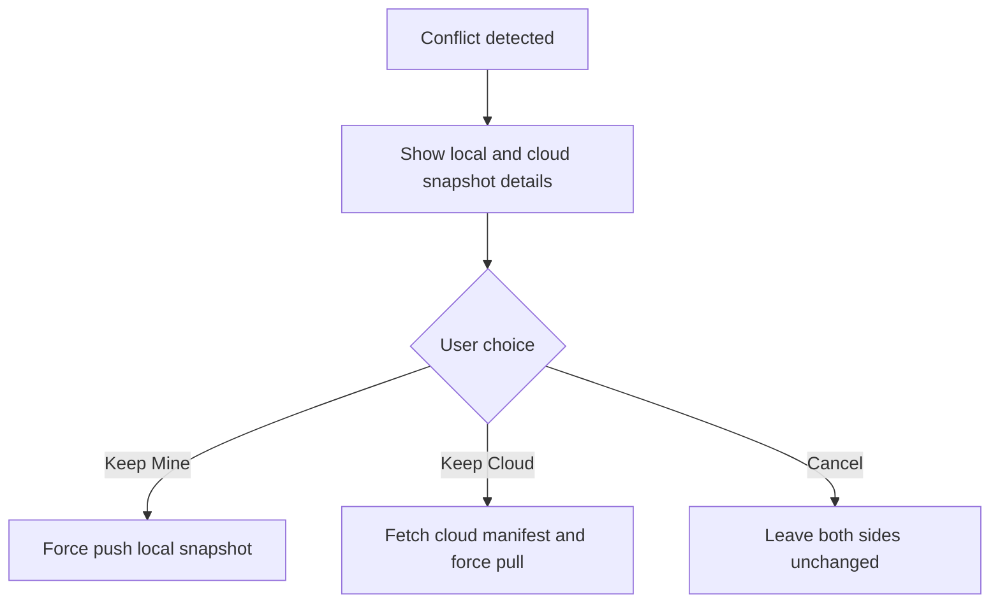

# SaveSync-Bridge User Guide

SaveSync-Bridge is a desktop app for syncing game saves between the current machine and Google Drive by combining Ludusavi, rclone, and a small amount of sync metadata.

The important rule is simple: the app syncs one whole game snapshot at a time. It does not merge individual files inside a save.

## What The Main Window Shows

The current UI is a Sync Center with these main areas:

- `Refresh` rescans games visible to Ludusavi on the current machine
- `Sync All` runs smart sync for every non-excluded game
- each game card shows last sync time, last sync date, current status, an exclusion checkbox, and one `Sync` button
- the left sidebar filters the list by `All Games`, `Local Newer`, `Conflicts`, `Synced`, and `Excluded`
- the `Backup Destination` panel summarizes the active Google Drive target
- the debug console shows exact CLI commands and output from Ludusavi and rclone

## Status Meanings

Each game ends up in one of these states:

- `Synced`: local and cloud hashes match
- `Local Newer`: local metadata is newer than the cloud copy
- `Cloud Newer`: cloud metadata is newer than the local copy
- `Conflict`: hashes differ and timestamps are equal
- `Unknown`: the app does not have enough metadata yet, or a sync failed

## Setup

## 1. Connect Google Drive

Open `Backups` from the toolbar or the `Manage Backups` button.

The dialog controls:

- `Drive Remote Name`: rclone remote name, default `gdrive`
- `Drive Folder`: optional top-level folder in Google Drive
- `Backup Library`: folder under that Drive location where SaveSync-Bridge stores game snapshots
- `Google Client ID` and `Google Client Secret`: optional custom OAuth app credentials
- `Ludusavi Binary`: optional override path if you do not want the bundled binary
- `Rclone Binary`: optional override path if you do not want the bundled binary

The dialog actions are:

- `Authenticate Google Drive`: start browser-based sign-in and save the token
- `Check Connection`: verify the saved token and current path
- `Refresh Sign-In`: refresh an expired or revoked token
- `Remove Saved Token`: delete the token for the current remote

Most users do not need a `.env` file. If you created your own Google OAuth desktop app, you can provide its client ID and secret directly in the dialog.

Config storage:

- Windows: `%APPDATA%/savesync-bridge/config.toml`
- Linux or Steam Deck: `~/.config/savesync-bridge/config.toml`

Saved token storage:

- Windows: `%APPDATA%/savesync-bridge/rclone.conf`
- Linux or Steam Deck: `~/.config/savesync-bridge/rclone.conf`

## 2. Refresh Your Local Game List

`Refresh` scans only the current machine. It does not browse Google Drive for game names.

Command used:

```text
ludusavi backup --preview --api
```

Flow:



## Daily Sync Workflow

The normal workflow is:

1. Refresh the local game list.
2. Review status badges and exclusions.
3. Click `Sync` on one game or `Sync All` for everything not excluded.
4. Resolve conflicts only when the app asks.

## How Smart Sync Works

This is the core flow used by both the per-game `Sync` button and `Sync All`.



### Why `Unknown` pushes

If neither side has enough metadata to compare, SaveSync-Bridge currently treats the current machine as the source of truth and creates the first cloud snapshot by uploading it.

## What A Push Actually Does

Push means creating a fresh staged backup on the current machine and uploading that snapshot.



Important details:

- the app uploads Ludusavi's staged backup, not raw live files directly from their original folders
- cloud storage now prefers a compressed archive plus metadata
- `manifest.json` is still uploaded for backward compatibility and restore logic

## What A Pull Actually Does

Pull means downloading the saved cloud snapshot, adapting it if the platform changed, then restoring it through Ludusavi.



Cross-platform restore works when the save paths are inside a Wine-style `drive_c` prefix. That includes Steam compatdata prefixes and non-Steam launchers like Heroic or Lutris when Ludusavi reports their paths under `drive_c`.

## Conflict Handling

A conflict happens when local and cloud hashes differ but their timestamps are equal.

When that occurs, the app opens a side-by-side comparison dialog and asks what to keep.



No automatic merge is attempted.

## What “Newer” Means

“Newer” is manifest-level, not file-level.

That means:

- SaveSync-Bridge compares one top-level timestamp for the local snapshot
- it compares that against one top-level timestamp for the cloud snapshot or sync metadata
- it does not inspect individual file modification times to choose a winner

## What Gets Replaced

This is the key behavior:

- the app never merges save files one-by-one
- a push replaces the cloud snapshot for that game
- a pull replaces the local snapshot for that game through Ludusavi restore
- the replacement unit is the whole staged backup for one game

## Excluding Games

Each game card has an exclusion checkbox.

- excluded games stay in the list
- excluded games appear under the `Excluded` filter
- excluded games are skipped by `Sync All`
- the exclusion list is saved in `config.toml` under `excluded_games`

## Debug Console

Use the debug console when:

- a game is missing from refresh results
- Google Drive authentication looks wrong
- cloud path settings are incorrect
- Ludusavi fails to back up or restore a title
- you need to inspect the exact CLI commands and stderr output

The panel shows the command, stdout, stderr, and exit code for Ludusavi and rclone operations.

## Cloud Layout

Each game is stored under:

```text
<backup_path>/<game_id>/
```

Current cloud format normally includes:

- `save.tar.gz`
- `sync_meta.json`
- `manifest.json`

Older snapshots may still contain an uncompressed Ludusavi backup layout instead of `save.tar.gz`.

## Local State Layout

The app keeps a cached manifest per game in:

- Windows: `%LOCALAPPDATA%/savesync-bridge/states/`
- Linux or Steam Deck: `~/.local/share/savesync-bridge/states/`

These files are sync metadata, not the actual game saves.

## Known Limits

- sync decisions are based on cached metadata, not a live three-way merge
- sync is game-level, not file-level
- native Linux save layouts outside Wine or Proton prefixes are not remapped into Windows paths
- `Unknown` currently defaults to upload on first sync

## Build And Run

```bash
uv sync
uv run savesync-bridge
```

Standalone build:

```bash
uv run build-exe
```

Windows output:

```text
dist/SaveSync-Bridge.exe
```